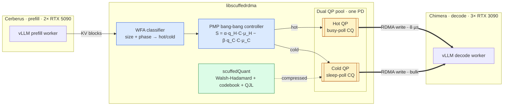
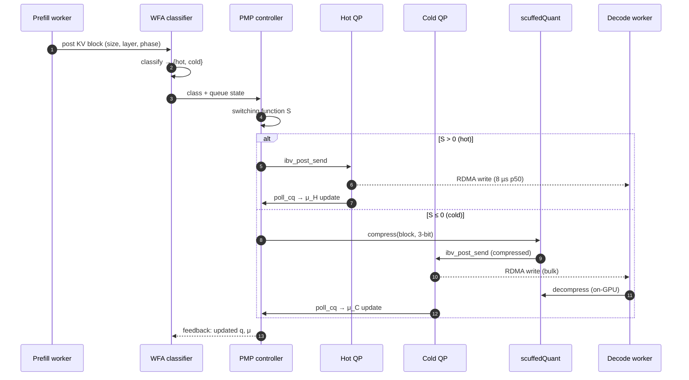
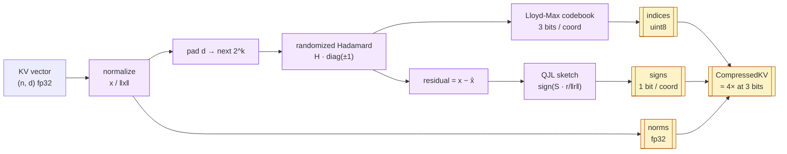

# ScuffedRDMA

Adaptive RDMA middleware for disaggregated LLM inference over commodity Ethernet.

MS Computer Science thesis, SUNY New Paltz. Author: Nathan Gopee. Advisors: Dr. Wafi Danesh, Dr. Ashley Suchy.

---

## Problem

Training and inference are structurally different workloads. Training is batch, long-running, checkpoint-driven; resource use is predictable and sustained. Inference is service-oriented, latency-sensitive, request-driven; resource use is bursty and per-request. Both share GPU hardware but share almost nothing in their scheduling, failure, or traffic profiles.

Disaggregated prefill/decode vLLM serving sits on the inference side of this split. Every decode step reads a growing KV cache that must be transported across nodes when prefill and decode live on separate hardware. On commodity 10GbE, a single RDMA queue pair serializes latency-critical metadata with multi-megabyte bulk KV transfers, causing head-of-line blocking. This project prototypes a software path over SoftRoCE that splits the single queue pair into two priority classes.

## Approach

### System architecture



### Transfer lifecycle



### scuffedQuant pipeline



Four components:

- **Dual QP pool.** Two RC queue-pair pools on one protection domain. Hot pool: busy-poll CQ. Cold pool: sleep-poll. Splits hot and cold traffic onto independent work queues.
- **WFA classifier.** Labels each transfer hot or cold from tensor size and prefill/decode phase. Logs the decision for every transfer.
- **PMP controller.** Bang-bang bandwidth allocation via Pontryagin's Maximum Principle. Switching function: `S = α·q_H·C·μ_H − β·q_C·C·μ_C`. Inputs: observed queue depth and measured service rates.
- **scuffedQuant.** Two-stage KV compression (TurboQuant). Stage 1: Walsh-Hadamard rotation + Lloyd-Max codebook at 3 bits, no calibration. Stage 2: 1-bit QJL sign sketch of the quantization residual. Individual vectors are lossy; inner products are preserved.

---

## Repository

| Path | Contents |
|------|----------|
| `middleware/` | Transport selector (TCP / SoftRoCE / TTPoe), RDMA bootstrap |
| `middleware/rdma_tensor_cache/` | Dual QP pool, WFA, PMP, scuffedQuant, vLLM KV connector |
| `middleware/tests/` | pytest suite for bootstrap and QP state machine |
| `benchmarks/` | Dual QP, UCX comparison, scuffedQuant LLM/MLX scripts |
| `deployment/` | Docker/K8s for Chimera/Cerberus, FA3 Blackwell patch |
| `Updates/` | Thesis updates 1–5 (LaTeX + PDF) |
| `scripts/` | SoftRoCE setup, cluster bring-up, benchmark sweep |
| `ucx/` | Submodule: [openucx/ucx](https://github.com/openucx/ucx) (upstream PR target) |
| `vllm/` | Submodule: [vllm-project/vllm](https://github.com/vllm-project/vllm) (reference) |
| `REFERENCES.md` | Full annotated bibliography |

## Hardware

| Node | Role | GPUs | VRAM | NIC | RDMA |
|------|------|------|------|-----|------|
| Cerberus | Prefill | 2× RTX 5090 | 64 GB | Intel X710 10GbE | SoftRoCE, iWARP SR-IOV |
| Chimera | Decode | 3× RTX 3090 | 72 GB | Aquantia AQC107 10GbE | SoftRoCE |
| Tower 1 | Dev | RTX 5070 Ti | 16 GB | ConnectX-4 100GbE | Hardware RoCEv2 |
| Tower 2 | Dev | 2× Tesla V100 | 64 GB | ConnectX-4 100GbE | Hardware RoCEv2, GPUDirect |

---

## Results

| Metric | Value | Source |
|--------|-------|--------|
| SoftRoCE loopback BW (Chimera) | 0.92 Gb/s | Update 4 |
| Single-QP p50 latency, 64 B | 12.6 µs | `results/ucx_comparison.json` |
| Dual QP overhead vs single QP | +0.6 µs | Update 4 |
| Cross-node decode latency (SoftRoCE) | 8 µs | `results/dual_qp_remote_benchmark.json` |
| UCX tag_bw cross-node | 111.86 MB/s | Update 4 |
| scuffedQuant 3-bit top-8 (Granite 3.3-2B, FP32) | 91.1% / 40 layers | `results/scuffed_quant_llm.json` |
| scuffedQuant 3-bit top-8 (Granite 3.3-2B, MLX 4-bit) | 100.0% / 40 layers | `results/scuffed_quant_mlx.json` |
| FA3 Blackwell patch, RTX 5090 | +15.5% throughput | `deployment/patches/` |
| gpt-oss-120b TCP baseline (3× 3090, MXFP4) | 104.4 tok/s | `deployment/benchmarks/` |

## Storage-tier notes

The thesis transport sits between GPU HBM and the NIC. On nodes with a parallel filesystem, the same classify-then-route idea extends downward into the storage tier: compressed KV blocks that libscuffedrdma writes over RDMA can land on a filesystem capable of distinguishing small hot metadata from bulk cold KV at the block layer.

- **GPFS (IBM Storage Scale)** exposes RDMA-over-Ethernet NSD clients with tunable block sizes. Large KV transfers amortise better against block sizes of **1–16 MiB**; small control-plane writes want **64–256 KiB** so they do not straddle block boundaries. Anthony Hsu et al. (IBM Community, 2026-02-06) report TTFT and inference cost each >10× improved at high KV reuse on 70B / 4× H100 / 128k context, with ~320 KB per KV entry and ~8 GB/s sustained from the storage tier.
- **Vincent Hsu (IBM Community, 2026-01-05)** describes the four-tier KV memory hierarchy (GPU HBM → CPU DRAM → local NVMe → network storage) that pairs Dynamo's KV block manager with Storage Scale's global namespace over BlueField-4. The libscuffedrdma transport layer is the dashed line between tiers 2 and 3/4 when the cluster has no BlueField.
- **sandook** ([mit-sandook/sandook](https://github.com/mit-sandook/sandook), NSDI 2026) aggregates NVMe SSDs into a unified block device with dynamic read/write workload isolation — a candidate GPFS-analog for clusters that cannot afford Storage Scale licensing. Its `blk_dev/` and `scheduler/control_plane/` directories document the workload-isolation mechanism that mirrors the hot/cold QP split in libscuffedrdma at the storage layer. See [REFERENCES.md](REFERENCES.md) entries [4d], [4e], [4g], [4h].

The KV-block-size interaction: vLLM's PagedAttention uses 16-token blocks (≈256 KiB at FP16 with 32 KV heads, head_dim=128); compressing to 3-bit via scuffedQuant shrinks each block to ≈32 KiB. A storage tier optimised for 1 MiB+ bulk writes sees aggregated block batches better than per-block writes, so the cold QP should coalesce 32–64 compressed blocks before flushing to persistent tier.

## Upstream Contributions

Six PRs against [openucx/ucx](https://github.com/openucx/ucx), reviewed in Update 5.

| PR | Fix | Issue |
|----|-----|-------|
| #11304 | Calculated rndv threshold for `ucp_tag_send_nbr` | #4430 |
| #11305 | Adaptive TX CQ moderation | #1307 |
| #11306 | Eager inline sends with CUDA MDs present | #4275 |
| #11307 | TCP fallback wireup for RC/DC (SoftRoCE fix) | #4794 |
| #11308 | Bandwidth query on `ucp_ep_query` | #6254 |
| #11309 | Symmetric traffic class propagation | #10325 |

---

## Built

- [x] Dual QP pool over SoftRoCE with WFA routing (loopback + cross-node; `benchmarks/results/dual_qp_benchmark.json`, `dual_qp_remote_benchmark.json`)
- [x] PMP controller implementation (`middleware/rdma_tensor_cache/pmp_controller.py`)
- [x] scuffedQuant: PolarQuant + QJL, run on Granite 3.3-2B KV cache (`benchmarks/results/scuffed_quant_llm.json`, `scuffed_quant_mlx.json`)
- [x] UCX codebase analysis → six upstream PRs submitted (#11304–#11309; review status in Update 5)
- [x] RDMA bootstrap: binary handshake, GID discovery, QP state machine with retry (`middleware/rdma_bootstrap.py`, `rdma_gid_discovery.py`, `rdma_qp_state_machine.py`)
- [x] Security audit (Update 5): four middleware findings fixed, six UCX PRs reviewed clean
- [x] Python MVP running on Chimera↔Cerberus 10GbE (Update 4)

## Planned

- [ ] vLLM `KvConnector` plug-in for disaggregated serving
- [ ] Multi-threaded cross-node benchmark with concurrent hot/cold traffic
- [ ] TTFT measurement on gpt-oss-120b split across both nodes
- [ ] Positional-encoding-aware WFA (route by predicted read frequency, not just size)
- [ ] Fused gather→Hadamard→rescale Triton kernel for scuffedQuant decompression
- [ ] Rust or C++ port of the hot-path data plane
- [ ] GPUDirect RDMA on Tower 2 (ConnectX-4 passthrough pending)

---

## Usage

```bash
# SoftRoCE cluster
scripts/start_cluster.sh --transport roce

# Dual QP benchmarks
python benchmarks/benchmark_dual_qp.py --iterations 1000
python benchmarks/benchmark_dual_qp_remote.py --role server --port 19877   # Cerberus
python benchmarks/benchmark_dual_qp_remote.py --role client --host cerberus --port 19877  # Chimera

# scuffedQuant on real LLM
python benchmarks/benchmark_scuffed_quant_llm.py --device cuda

# Aggregate → LaTeX
python benchmarks/aggregate_results.py --results-dir benchmarks/results
```

## Timeline

| Window | Milestone | Status |
|--------|-----------|--------|
| Jan–Feb 2026 | Hardware bring-up, Updates 1–3 | done |
| Mar–Apr 2026 | Python MVP, UCX PRs, scuffedQuant | done |
| May–Jul 2026 | KvConnector integration, TTFT measurement | in progress |
| Aug–Oct 2026 | Native port, full thesis draft | planned |
| Nov–Dec 2026 | Defense | planned |

## Citations

Full bibliography in [REFERENCES.md](REFERENCES.md). Core references the design leans on:

- Kwon et al., *PagedAttention*, SOSP 2023. [arXiv:2309.06180](https://arxiv.org/abs/2309.06180)
- Dao, *FlashAttention-2*. [arXiv:2307.08691](https://arxiv.org/abs/2307.08691)
- Zandieh et al., *TurboQuant*. [arXiv:2504.19874](https://arxiv.org/abs/2504.19874)
- Pontryagin et al., *The Mathematical Theory of Optimal Processes*, 1962.

## License

[MIT](LICENSE). Author: Nathan Gopee 
