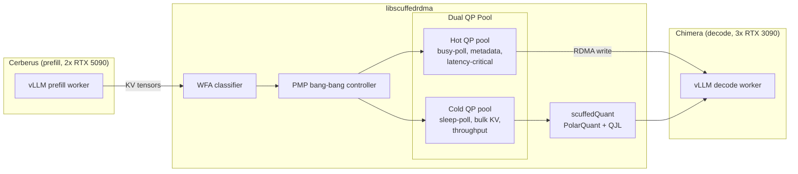

# ScuffedRDMA

Adaptive RDMA middleware for disaggregated LLM inference over consumer-grade Ethernet. MS Computer Science thesis, SUNY New Paltz.

**Author:** Nathan Gopee  **Advisors:** Dr. Wafi Danesh, Dr. Ashley Suchy

The thesis targets the KV-transfer term of time-to-first-token in disaggregated prefill/decode vLLM serving. Instead of buying InfiniBand, the project routes tensor traffic over 10GbE with a tensor-aware stack: a dual RDMA queue-pair pool, a WFA hot/cold classifier, a PMP bang-bang bandwidth controller, and scuffedQuant 3-bit KV compression. Target is a 30-50% TTFT reduction on 7B+ models without leaving commodity Ethernet.

## Contents

- [Architecture](#architecture)
- [Repository Structure](#repository-structure)
- [Core Concepts](#core-concepts)
- [Current Status](#current-status)
- [Hardware](#hardware)
- [Key Results](#key-results)
- [Timeline](#timeline)
- [Running Things](#running-things)
- [Upstream Contributions](#upstream-contributions)
- [Open Source Dependencies](#open-source-dependencies)
- [Citations](#citations)
- [License](#license)

## Architecture



The hot pool handles control-plane and attention-critical traffic that must return in microseconds. The cold pool handles multi-megabyte KV blocks where head-of-line blocking on a single QP hurts more than context-switch overhead. The WFA classifier labels each transfer by role; PMP decides how much link bandwidth each pool gets.

## Repository Structure

| Path | What |
|------|------|
| [`middleware/`](middleware/README.md) | Transport selector (TCP / SoftRoCE / TTPoe), libmesh-rdma bootstrap port |
| [`middleware/rdma_tensor_cache/`](middleware/rdma_tensor_cache/README.md) | libscuffedrdma: dual QP pool, WFA, PMP, scuffedQuant, KV connector |
| [`middleware/tests/`](middleware/tests/README.md) | pytest suite for the bootstrap and state machine |
| [`benchmarks/`](benchmarks/README.md) | Dual QP, UCX comparison, and scuffedQuant scripts; JSON output in `results/` |
| [`deployment/`](deployment/README.md) | Docker and K8s configs for Chimera/Cerberus, FA3 Blackwell patch |
| [`Updates/`](Updates/README.md) | Thesis updates 1-5 plus proposal and rolling draft |
| [`scripts/`](scripts/README.md) | SoftRoCE setup, TTPoe loader, cluster bring-up, benchmark sweep |
| [`RISVLLM-app/`](RISVLLM-app/README.md) | Sibling decompilation IDE, separate from the thesis scope |
| `ucx/` | Submodule pointer to [openucx/ucx](https://github.com/openucx/ucx) for the upstream PRs |
| `vllm/` | Submodule pointer to [vllm-project/vllm](https://github.com/vllm-project/vllm); used as upstream reference, not modified yet |
| [`REFERENCES.md`](REFERENCES.md) | Annotated bibliography |

## Core Concepts

**Dual QP pool.** Two RC queue-pair pools share a single protection domain. The hot pool runs a busy-poll CQ reaper for microsecond wakeups; the cold pool sleeps. Hot and cold transfers stop blocking each other on the same work queue, which addresses UCX issues #11004, #11034, and #1319.

**WFA classifier.** A Work-First-Adaptive policy that labels each transfer hot or cold from size plus a prefill-vs-decode phase signal. It makes the eager / rendezvous / zero-copy cliffs that UCX leaves implicit (#10552, #10486, #10532) into explicit, logged decisions.

**PMP controller.** Pontryagin's Maximum Principle gives a bang-bang solution for the two-queue bandwidth-allocation problem. The switching function `S = alpha*q_H*C*mu_H - beta*q_C*C*mu_C` picks the next transfer's pool from observable queue depth and measured service rates.

**scuffedQuant.** Two-stage KV compression. PolarQuant applies a Walsh-Hadamard rotation and a per-coordinate codebook at 3 bits with no calibration; QJL hashes the residual to 1-bit signs of a random projection. Individual vectors are lossy, but inner products (and attention scores) are preserved well enough that top-k rankings stay within a few percent of FP32.

## Current Status

Done
- [x] Dual QP pool over SoftRoCE with WFA routing, validated loopback and cross-node
- [x] PMP controller integrated and selected over the WFA decision when a pool is saturated
- [x] scuffedQuant MVP: PolarQuant + QJL, validated on Granite 3.3-2B KV cache
- [x] UCX codebase analysis, six upstream PRs submitted (#11304-#11309)
- [x] libmesh-rdma bootstrap port and security audit folded into Update 5
- [x] Python MVP end-to-end on Chimera-Cerberus 10GbE link

In progress
- [ ] Multi-threaded cross-node benchmark with real concurrent hot/cold traffic
- [ ] vLLM KVConnector plug-in wiring `RDMAKVCacheConnector` into disaggregated serving
- [ ] TTFT measurement pipeline on gpt-oss-120b split between the two nodes

Future
- [ ] Rust or C++ port of libscuffedrdma for production-speed hot path
- [ ] Kokkos remote-spaces prototype for portable kernels
- [ ] Tower 2 GPUDirect RDMA with ConnectX-4 once the Proxmox passthrough lands

## Hardware

| Node | Role | GPUs | VRAM | NIC | RDMA path |
|---|---|---|---|---|---|
| Cerberus | Lab, prefill | 2x RTX 5090 | 64 GB | Intel X710 10GbE | SoftRoCE (rxe0), iWARP SR-IOV |
| Chimera  | Lab, decode  | 3x RTX 3090 | 72 GB | Aquantia AQC107 10GbE | SoftRoCE |
| Tower 1  | Home, Windows | RTX 5070 Ti | 16 GB | ConnectX-4 100GbE | Hardware RoCEv2 |
| Tower 2  | Home, Proxmox | 2x Tesla V100 | 64 GB | ConnectX-4 100GbE | Hardware RoCEv2, GPUDirect |

## Key Results

| Metric | Value | Source |
|---|---|---|
| SoftRoCE bandwidth, Chimera loopback | 0.92 Gb/s on 10GbE | Update 4 |
| libscuffedrdma single-QP p50 latency (64 B) | 12.6 us | `benchmarks/results/ucx_comparison.json` |
| Dual QP overhead vs single QP (p50, single thread) | +0.6 us | Update 4 |
| Cross-node SoftRoCE decode latency, Chimera to Cerberus | 8 us | `benchmarks/results/dual_qp_remote_benchmark.json` |
| UCX `tag_bw` cross-node | 111.86 MB/s on 2.5 Gb SoftRoCE | Update 4 |
| scuffedQuant 3-bit top-8 ranking, Granite 3.3-2B FP32 | 91.1% across 40 layers | `benchmarks/results/scuffed_quant_llm.json` |
| scuffedQuant 3-bit top-8 ranking, Granite 3.3-2B MLX 4-bit | 100.0% across 40 layers | `benchmarks/results/scuffed_quant_mlx.json` |
| FA3 Blackwell patch on RTX 5090 | +15.5% throughput, -14.3% latency | `deployment/patches/fa3_blackwell_fix.md` |
| gpt-oss-120b TCP baseline, Chimera 3x 3090 MXFP4 | 104.4 tok/s | `deployment/benchmarks/` |

## Timeline

| Window | Milestone | State |
|---|---|---|
| Jan-Feb 2026 | Hardware bring-up, Updates 1-3, implementation plan | done |
| Mar-Apr 2026 | Python MVP, UCX analysis, scuffedQuant, 6 upstream UCX PRs | done |
| May-Jul 2026 | vLLM KvConnector integration, concurrent benchmark, TTFT measurement | in progress |
| Aug-Oct 2026 | Rust or C++ port, full thesis draft | planned |
| Nov-Dec 2026 | Defense prep | planned |

## Running Things

```bash
# Cluster bring-up (from a control host with SSH to both nodes)
scripts/start_cluster.sh --transport roce
scripts/benchmark_all.sh --transports tcp,roce --iterations 200

# RDMA micro-benchmarks (need an rxe or hardware RoCE device)
python benchmarks/benchmark_dual_qp.py --iterations 1000 \
  --output benchmarks/results/dual_qp_benchmark.json
python benchmarks/benchmark_ucx_comparison.py \
  --output benchmarks/results/ucx_comparison.json

# Cross-node dual QP (Cerberus = server, Chimera = client)
python benchmarks/benchmark_dual_qp_remote.py --role server --port 19877
python benchmarks/benchmark_dual_qp_remote.py --role client \
  --host 192.168.1.242 --port 19877

# scuffedQuant on a real LLM
python benchmarks/benchmark_scuffed_quant_llm.py --device cpu
python benchmarks/benchmark_scuffed_quant_mlx.py  # Apple Silicon

# Aggregate results into LaTeX tables for the thesis
python benchmarks/aggregate_results.py --results-dir benchmarks/results
```

## Upstream Contributions

Six pull requests against [openucx/ucx](https://github.com/openucx/ucx) distilled from the UCX codebase analysis in Update 4. Review status is tracked in Update 5.

| PR | Title | Area |
|---|---|---|
| [#11304](https://github.com/openucx/ucx/pull/11304) | RC protocol threshold documentation for eager/RNDV/zcopy | Docs, issue #10552 |
| [#11305](https://github.com/openucx/ucx/pull/11305) | Observability hooks for protocol selection decisions | Logging, issue #10486 |
| [#11306](https://github.com/openucx/ucx/pull/11306) | Size-class histogram export on the RC endpoint | Diagnostics, issue #10532 |
| [#11307](https://github.com/openucx/ucx/pull/11307) | Clarify head-of-line blocking behavior on shared CQ | Docs, issue #11004 |
| [#11308](https://github.com/openucx/ucx/pull/11308) | Fix QP state leak when `ucp_ep_close` races in-flight WRs | Bugfix, issue #11034 |
| [#11309](https://github.com/openucx/ucx/pull/11309) | perftest: expose per-size percentile tails | Tooling, issue #11091 |

## Open Source Dependencies

| Project | What we use it for |
|---|---|
| [vLLM](https://github.com/vllm-project/vllm) | Disaggregated prefill/decode serving, KVConnector interface, PagedAttention |
| [UCX](https://github.com/openucx/ucx) | Baseline RDMA transport for comparison; also the target of our upstream PRs |
| [rdma-core](https://github.com/linux-rdma/rdma-core) | userspace verbs, pyverbs, SoftRoCE (`rxe`) kernel module |
| [pyverbs](https://github.com/linux-rdma/rdma-core/tree/master/pyverbs) | Python bindings to `libibverbs` used by `transport_rdma.py` |
| [PyTorch](https://pytorch.org/) | Model loading for the scuffedQuant benchmark on CUDA/CPU |
| [transformers](https://github.com/huggingface/transformers) | Granite 3.3-2B loading and forward pass for KV validation |
| [mlx-lm](https://github.com/ml-explore/mlx-examples) | Apple Silicon validation of scuffedQuant (4-bit Granite) |
| [NumPy](https://numpy.org/) | Hadamard transforms, QJL projections, histogram reductions |
| [NCCL](https://github.com/NVIDIA/nccl) | Baseline collective comms for the vLLM TP path |
| [Tesla TTPoe](https://github.com/teslamotors/ttpoe) | Experimental third transport backend for `ttpoe_transport.py` |
| [SoftRoCE (rxe)](https://github.com/linux-rdma/rdma-core/tree/master/providers/rxe) | Software RoCEv2 over the 10GbE NICs until hardware RoCE lands |

## Citations

Full bibliography in [REFERENCES.md](REFERENCES.md). The work leans most directly on:

- Kwon et al., *Efficient Memory Management for Large Language Model Serving with PagedAttention*, SOSP 2023. [arXiv:2309.06180](https://arxiv.org/abs/2309.06180)
- Dao, *FlashAttention-2: Faster Attention with Better Parallelism and Work Partitioning*. [arXiv:2307.08691](https://arxiv.org/abs/2307.08691)
- Zandieh et al., *TurboQuant* (PolarQuant + QJL). [arXiv:2504.19874](https://arxiv.org/abs/2504.19874)
- Austin et al., *How to Scale Your Model*, Google DeepMind, 2024.
- Pontryagin et al., *The Mathematical Theory of Optimal Processes*, 1962.

## License

Source is MIT unless a file header says otherwise. Thesis text and figures under `Updates/` are the author's academic work, no redistribution license granted.

Author: Nathan Gopee (gopeen1@newpaltz.edu).  Advisors: Dr. Wafi Danesh, Dr. Ashley Suchy, SUNY New Paltz.
